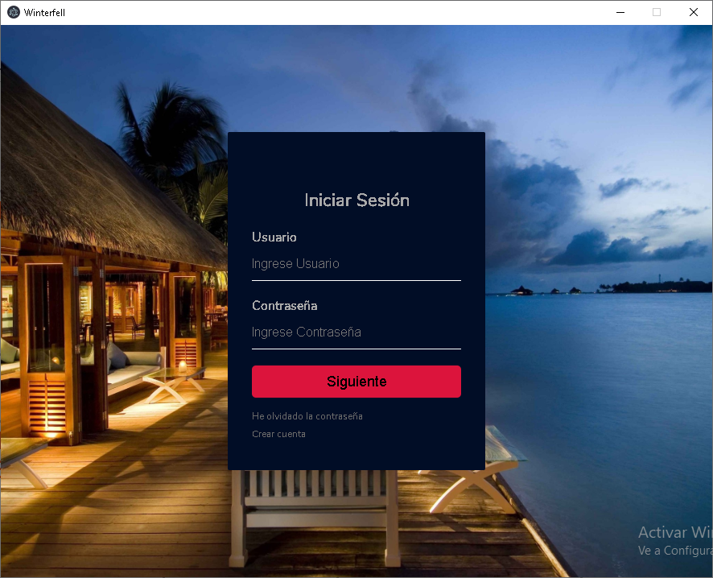
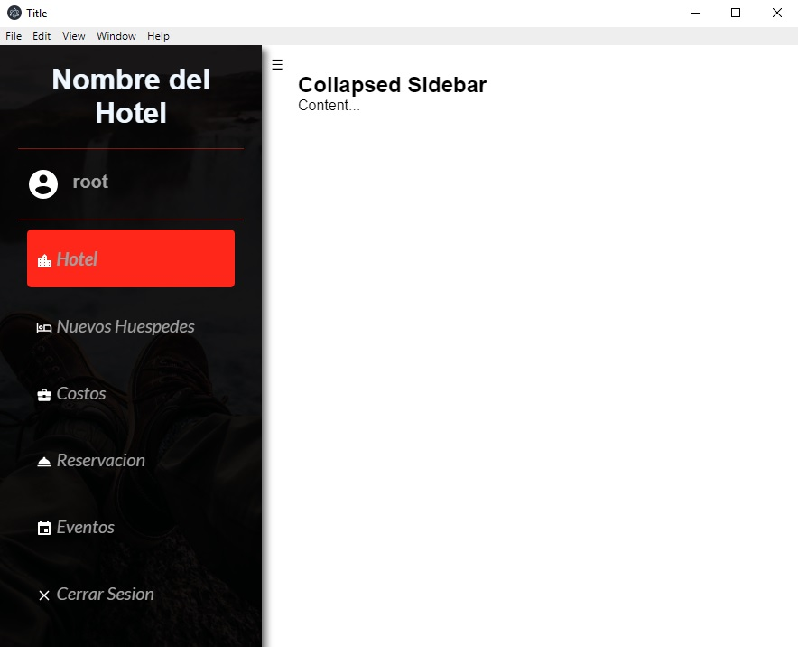
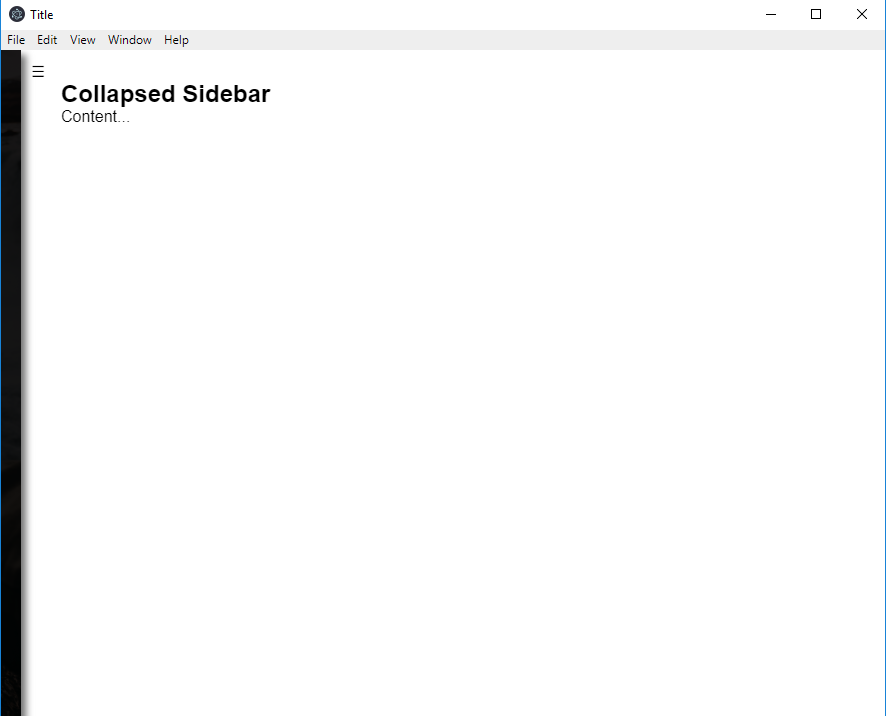
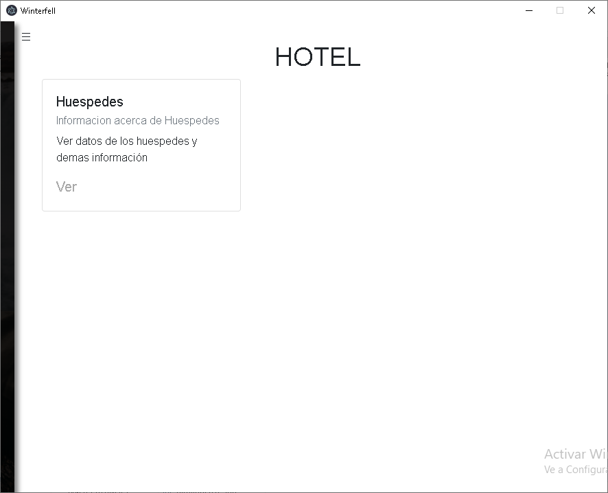
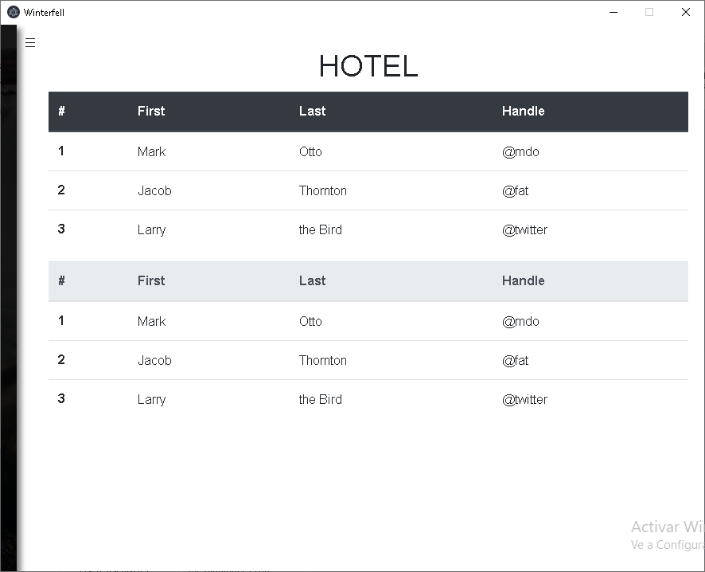
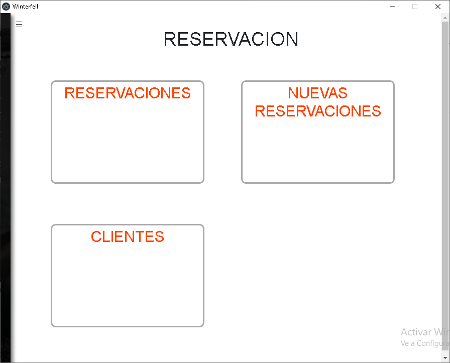
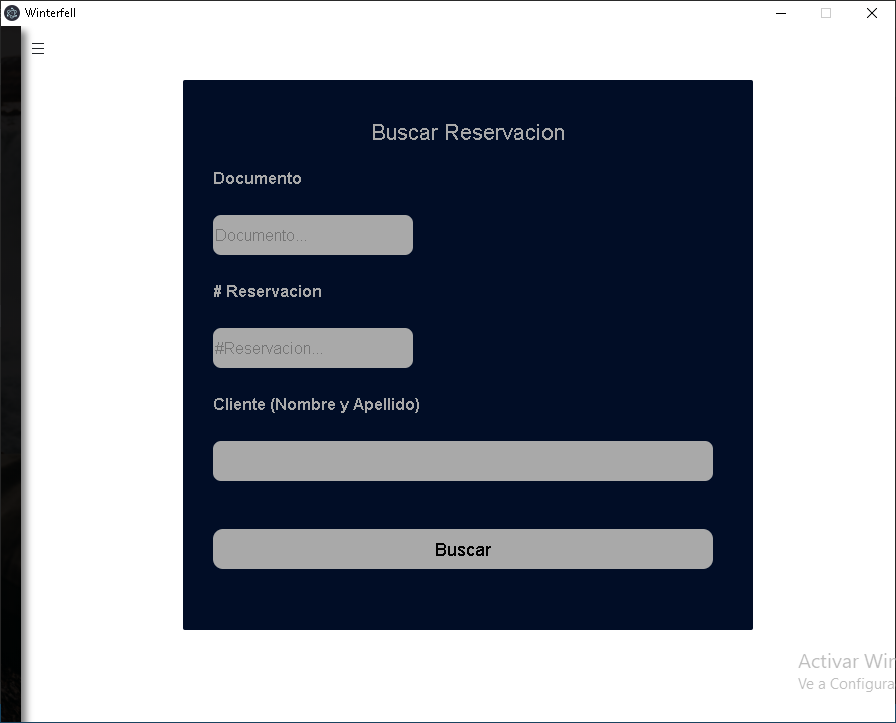
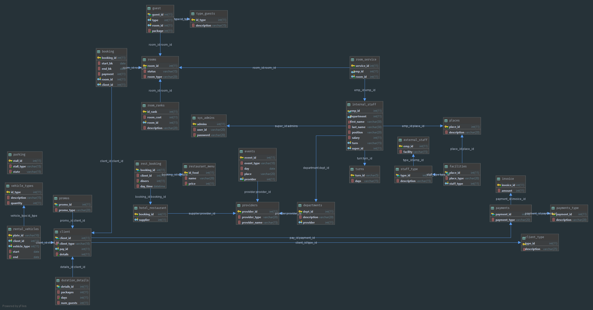

## Electron app with MySQL connection
# Screenshots
- login

- Sidebar

- Colapsed Sidebar

- Hotel Card

- Guest Table

- Booking Menu

- Booking Menu Hover

- Form 1

-  Database Schema

# npm dependecies
- electron
- mysql
- electron-reload

